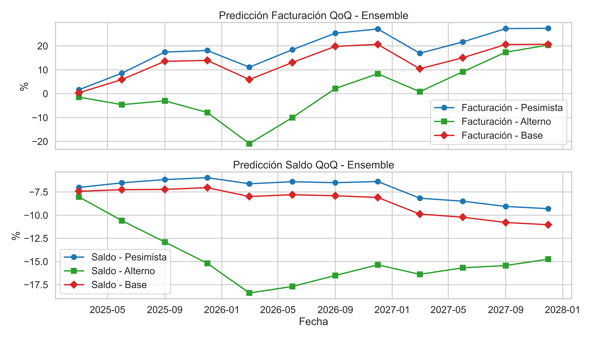

# Pronóstico Trimestral de Cuentas Financieras – Tuya (2025–2027)

## 1. Introducción
Este proyecto tiene como propósito desarrollar y aplicar **modelos de pronóstico trimestral** para las cuentas de **Facturación** y **Saldo** de Tuya durante el período **2025–2027**.

Estos pronósticos forman parte de las pruebas de resistencia presentadas anualmente ante la **Superintendencia Financiera de Colombia**, con el objetivo de evaluar la resiliencia de la compañía frente a escenarios económicos adversos y asegurar su **estabilidad, solvencia y liquidez**.

De manera complementaria, se exploran metodologías avanzadas de estimación para **incrementar la precisión de los modelos** y reducir los errores por debajo del 10%, mejorando el cumplimiento de los requisitos regulatorios.

---

## 2. Alcance del proyecto
El trabajo se centra en la generación de pronósticos para las cuentas de **Facturación** y **Saldo** bajo tres escenarios macroeconómicos:

- **Base**
- **Pesimista**
- **Alterno**

Estos escenarios consideran impactos relevantes en variables macroeconómicas y permiten evaluar la trayectoria financiera futura de la compañía.

### Expectativas clave del comité
- **+25 %** en la facturación de diciembre de 2027 respecto a diciembre de 2024.
- **−3 %** en la facturación de junio de 2026 respecto a diciembre de 2025.
- **−3 %** en la facturación de junio de 2027 respecto a diciembre de 2026.
- **+15 %** en el saldo de diciembre de 2027 respecto a diciembre de 2024.

---

## 3. Metodología general
La metodología a seguir en este proyecto se estructurará en las siguientes fases generales las cuales se encuentran detalladas y estructuradas en los notebooks denominados con incisos similares:

1. **Análisis Exploratorio de Datos (EDA)**  
   Se realizará una exploración de las hojas **"BASE"** y **"MACROS"** del archivo Excel proporcionado para comprender la estructura de los datos, identificar la estadistica descriptiva basica, patrones, tendencias, anomalías y la relación entre las variables de Facturación y Saldo con las variables macroeconómicos.

2. **Selección de Características**  
   Se identificarán y seleccionarán las variables más relevantes para la construcción de los modelos de pronóstico, incluyendo la incorporación de variables macroeconómicas que ofrezcan una explicabilidad y sentido lógico con las cuentas a modelar, acorde con la realidad del negocio y a la disponibilidad de las mismas.

3. **Entrenamiento de Modelos**  
   Se procederá al entrenamiento de diferentes modelos de pronóstico como Prophet, Sarimax y regresión lineal ridge. El objetivo final es construir dos nuevos modelos que busquen mejorar la precisión y reducir el error por debajo del 10%.

4. **Evaluación de Escenarios**  
   Finalmente, se realizará la evaluación de los modelos bajo los escenarios **Base**, **Adverso** y **Alterno**.  
   Se generarán los pronósticos trimestrales para los años 2025, 2026 y 2027, y se presentarán los resultados de manera clara y comprensible, destacando las trayectorias futuras de las cuentas de Facturación y Saldo en cada escenario.
---

## 4. Hallazgos del Análisis Exploratorio de Datos (EDA)

### Calidad y estructura de los datos
- Disponibilidad de **36 observaciones trimestrales** para facturación y saldo.
- Ausencia de datos en un 25 % de las observaciones de facturación y saldo.
- Alta correlación entre algunas variables internas, lo que obliga a un proceso riguroso de selección de características.

### Comportamiento histórico
- **Facturación:** Volatilidad alta en cambios trimestrales (QoQ), con recuperación posterior a 2021.
- **Saldo:** Comportamiento más estable y menos sensible a variaciones abruptas.

### Dependencia macroeconómica
- La **facturación** se relaciona positivamente con el PIB y negativamente con el desempleo.
- El **saldo** muestra mayor sensibilidad a la tasa de cambio.

### Conclusiones Finales del EDA

- **Modelado con enfoques simples:**  
  Se optará por el uso de modelos relativamente simples como **SARIMAX**, **Prophet** y **Regresión Lineal Ridge**, dado que el número de observaciones disponibles es reducido y no permite el uso efectivo de modelos más complejos o de machine learning clásico.

- **Exclusión de variables dummies y desembolsos:**  
  Las variables **dummies** y **desembolsos** serán descartadas debido a la ausencia de información histórica suficiente y a la necesidad de aplicar métodos de imputación complejos para escenarios y años en los que no existen datos.  
  Por tanto, para la base interna solo se utilizarán **facturación** y **saldo**, las cuales constituyen las variables objetivo (target).

- **Selección robusta de variables macroeconómicas:**  
  En cuanto a las variables macroeconómicas, se emplearán técnicas más avanzadas de **selección de características** que permitan identificar los factores más relevantes y guiar la toma de decisiones en el modelado.

- **Entrenamiento mediante validación cruzada temporal:**  
  Debido a la **escasez de datos disponibles**, el uso de un esquema tradicional de *train-test split* no resulta adecuado, ya que reduce de forma considerable la cantidad de información disponible para el entrenamiento.  
  Para optimizar el aprovechamiento del histórico, se utilizará **TimeSeriesSplit** como técnica de validación cruzada.  
  Este método permite evaluar los modelos respetando la secuencia temporal de los datos y asegurando que el entrenamiento siempre se realice con información del pasado y las pruebas con datos futuros.

---

## 5. Selección de Características

### Enfoque aplicado
En la construcción de modelos predictivos, la **selección de características** es una etapa clave para garantizar que los modelos sean robustos, eficientes y eviten el sobreajuste.  
Dado que las bases de datos suelen incluir múltiples variables que pueden describir el mismo fenómeno, este proceso busca **identificar las variables más relevantes y eliminar aquellas redundantes o poco informativas**.

---

### Estrategia utilizada
El procedimiento seguido se centró en:

1. **Evaluación de la multicolinealidad:**  
   Se analizaron las correlaciones entre variables para detectar redundancias.  
   Cuando dos o más variables mostraron una correlación muy alta, se consideró que aportaban información similar.

2. **Selección basada en información mutua:**  
   Para cada grupo de variables altamente correlacionadas, se utilizó la **información mutua** con la variable objetivo como criterio de selección.  
   La información mutua mide la dependencia entre dos variables y nos indica cuánto conocimiento adicional sobre la variable objetivo aporta una variable específica.  
   De este modo, se conservó la variable que maximiza la información mutua con el target, garantizando mayor relevancia predictiva.

---

### Resultados del proceso
Tras aplicar este método, se definieron los conjuntos óptimos de variables para cada cuenta a pronosticar:

- **Para Facturación:**  
  - `Desempleo`  
  - `Tasa_Cambio`  
  - `TASA REPO`  
  - `PIB (var. % anual, nominal)`

- **Para Saldo:**  
  - `Desempleo`  
  - `Tasa_Cambio`  
  - `TASA REPO`  
  - `CH2`

Este proceso reduce la complejidad y mejora la capacidad predictiva.

---

## 6. Entrenamiento de modelos

### Procedimiento aplicado
- Consolidación y limpieza de datos.
- Escalado de variables predictoras y objetivos.
- Validación cruzada temporal mediante **TimeSeriesSplit**.
- Evaluación usando **RMSE** y posteriormente **MAPE**.
- Optimización de hiperparámetros con Optuna
- Selección del mejor modelo para Ridge, SARIMAX y Prophet.
- Implementacion de un **ensemble simple (promedio)** combinando las predicciones de los tres modelos.

### Selección final
El **modelo Ensemble** (promedio de los tres modelos) fue el seleccionado por mostrar el **menor MAPE** en validación.

| Target       | Ridge  | SARIMAX | Prophet | Ensemble |
|--------------|--------|---------|---------|----------|
| Facturación  | 138.12 | 178.08  | 139.33  | **124.56** |
| Saldo        | 126.88 | 115.04  | 135.32  | **85.29** |

Ninguno de los modelos logró alcanzar el objetivo de un error inferior al 10%. Esto se debe principalmente a la **limitada cantidad de datos históricos disponibles**.  
Los errores podrían reducirse si se implementan:
1. Más variables exógenas (features internas y externas adicionales).
2. Un mayor historial de datos trimestrales.
3. Estrategias avanzadas de **ingeniería de características** (transformaciones logarítmicas, interacciones, medias móviles, entre otras).

Estas estrategias no se aplicaron en esta fase debido al tiempo limitado y al carácter exploratorio de este ejercicio.

---

## 7. Evaluación de escenarios

Tras la generación de los pronósticos se procede a evaluar el cumplimiento de los hitos definidos para el negocio en el escenario Base, así como analizar la evolución de los escenarios Pesimista y Alterno. La comparación se realiza para las dos variables objetivo: **Facturación** y **Saldo**.

### Resultados de Validación para Saldo

| Modelo                 | Hito              | Pred (%)   | Hito a cumplir (%) | Error (%)     | Cumple     |
|------------------------|-------------------|------------|--------------------|---------------|------------|
| saldo_ridge_abs       | 27_vs_24          | -13.38     | 15.0              | -28.38        | No cumple  |
| saldo_ridge_abs       | jun26_vs_dic25    | -2.07      | NaN               | NaN           | None       |
| saldo_ridge_abs       | jun27_vs_dic26    | -2.34      | NaN               | NaN           | None       |
| saldo_sarimax_abs     | 27_vs_24          | -74.99     | 15.0              | -89.99        | No cumple  |
| saldo_sarimax_abs     | jun26_vs_dic25    | -22.16     | NaN               | NaN           | None       |
| saldo_sarimax_abs     | jun27_vs_dic26    | -24.27     | NaN               | NaN           | None       |
| saldo_prophet_abs     | 27_vs_24          | -51.52     | 15.0              | -66.52        | No cumple  |
| saldo_prophet_abs     | jun26_vs_dic25    | -12.01     | NaN               | NaN           | None       |
| saldo_prophet_abs     | jun27_vs_dic26    | -13.07     | NaN               | NaN           | None       |
| saldo_ensemble_abs    | 27_vs_24          | -52.26     | 15.0              | -67.26        | No cumple  |
| saldo_ensemble_abs    | jun26_vs_dic25    | -12.27     | NaN               | NaN           | None       |
| saldo_ensemble_abs    | jun27_vs_dic26    | -13.46     | NaN               | NaN           | None       |

**Análisis:**  
Para la variable **Saldo**, ninguno de los modelos ni el ensemble lograron cumplir el hito de crecimiento del 15 % para el periodo 2027 vs. 2024. Todos los modelos proyectan una disminución significativa, con el modelo Ridge siendo el que predice una caída menos pronunciada (-13.38 %). Los hitos intermedios (junio 2026 vs. diciembre 2025 y junio 2027 vs. diciembre 2026) no contaban con un valor de referencia establecido (NaN).

---

### Resultados de Validación para Facturación

| Modelo                       | Hito              | Pred (%)   | Hito a cumplir (%) | Error (%)     | Cumple     |
|------------------------------|-------------------|------------|--------------------|---------------|------------|
| facturacion_ridge_abs       | 27_vs_24          | 436.11     | 25.0              | 411.11        | No cumple  |
| facturacion_ridge_abs       | jun26_vs_dic25    | 29.24      | -3.0              | 32.24         | No cumple  |
| facturacion_ridge_abs       | jun27_vs_dic26    | 38.04      | -3.0              | 41.04         | No cumple  |
| facturacion_sarimax_abs     | 27_vs_24          | 713.39     | 25.0              | 688.39        | No cumple  |
| facturacion_sarimax_abs     | jun26_vs_dic25    | 38.58      | -3.0              | 41.58         | No cumple  |
| facturacion_sarimax_abs     | jun27_vs_dic26    | 50.50      | -3.0              | 53.50         | No cumple  |
| facturacion_prophet_abs     | 27_vs_24          | 103.65     | 25.0              | 78.65         | No cumple  |
| facturacion_prophet_abs     | jun26_vs_dic25    | -4.13      | -3.0              | -1.13         | Cumple     |
| facturacion_prophet_abs     | jun27_vs_dic26    | -1.26      | -3.0              | 1.74          | Cumple     |
| facturacion_ensemble_abs    | 27_vs_24          | 355.16     | 25.0              | 330.16        | No cumple  |
| facturacion_ensemble_abs    | jun26_vs_dic25    | 20.50      | -3.0              | 23.50         | No cumple  |
| facturacion_ensemble_abs    | jun27_vs_dic26    | 28.10      | -3.0              | 31.10         | No cumple  |

**Análisis:**  
Para la variable **Facturación**, el modelo Prophet es el único que logra cumplir con los hitos de decrecimiento del -3 % para los periodos intermedios (junio 2026 vs. diciembre 2025 y junio 2027 vs. diciembre 2026). Sin embargo, para el hito general 2027 vs. 2024 (25 %), todos los modelos, incluido Prophet, predicen un crecimiento muy superior, resultando en un "No cumple". Esto indica que Prophet captura mejor los cambios a corto plazo, pero su proyección a largo plazo difiere significativamente de las expectativas.

---

## 8. Interpretación final

  

El análisis detallado de los escenarios se realiza a partir del **modelo Ensemble**, seleccionado por presentar el **menor error MAPE** durante el entrenamiento y validación cruzada. Las principales conclusiones son:

#### Facturación
- Los tres escenarios muestran **tendencias crecientes** durante el horizonte 2025–2027.
- **Pesimista:** Crecimiento continuo, alcanzando valores cercanos al 28 % en 2027, con picos en 2026 (≈26 %).
- **Alterno:** Presenta una **contracción fuerte en 2026** (caída de -21 %), seguida de una recuperación hasta 21 % al cierre de 2027.
- **Base:** Evolución intermedia, con un crecimiento estable y sostenido, llegando a 21 % en 2027.

#### Saldo
- A diferencia de la facturación, los escenarios de saldo mantienen valores **negativos durante todo el periodo**.
- **Pesimista:** Caídas moderadas entre -6 % y -5 %, con ligera mejora en 2026, pero sin alcanzar valores positivos.
- **Alterno:** La mayor contracción, hasta -14.5 % en marzo de 2026, con recuperación posterior, cerrando 2027 en -7 %.
- **Base:** Evolución similar al pesimista, con caídas suaves pero persistentes (entre -7 % y -5.6 %), cerrando 2027 en -7 %.

#### Conclusión final
- **Divergencia estructural:** Mientras la facturación crece en todos los escenarios, el saldo sigue en terreno negativo.
- **Alta incertidumbre:** 2026 se identifica como un año crítico en términos de vulnerabilidad, especialmente en el escenario alterno.
- **Próximos pasos:** Incorporar más variables exógenas y ampliar el histórico para reducir la incertidumbre y mejorar la capacidad predictiva de los modelos.

---
